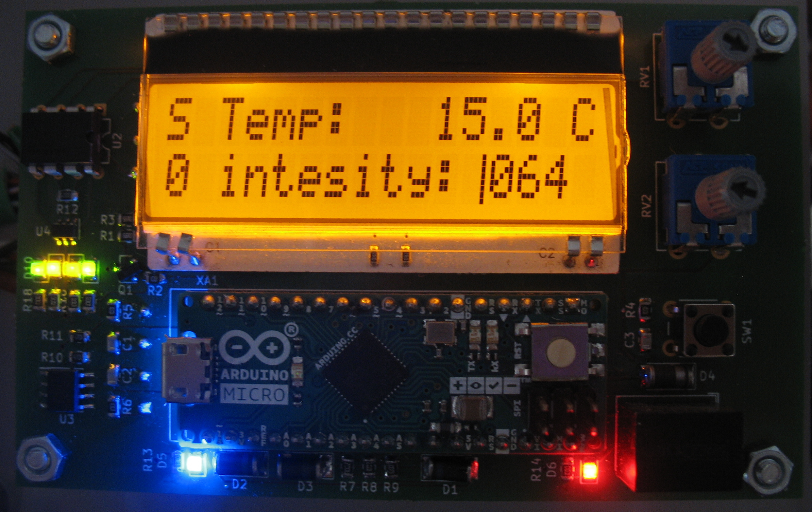
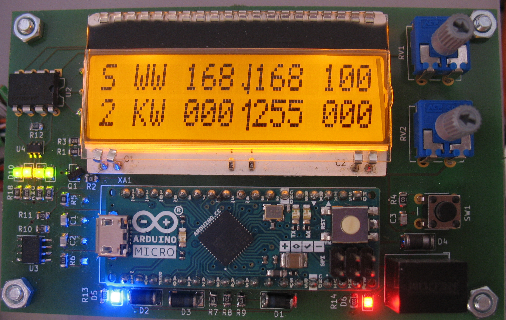
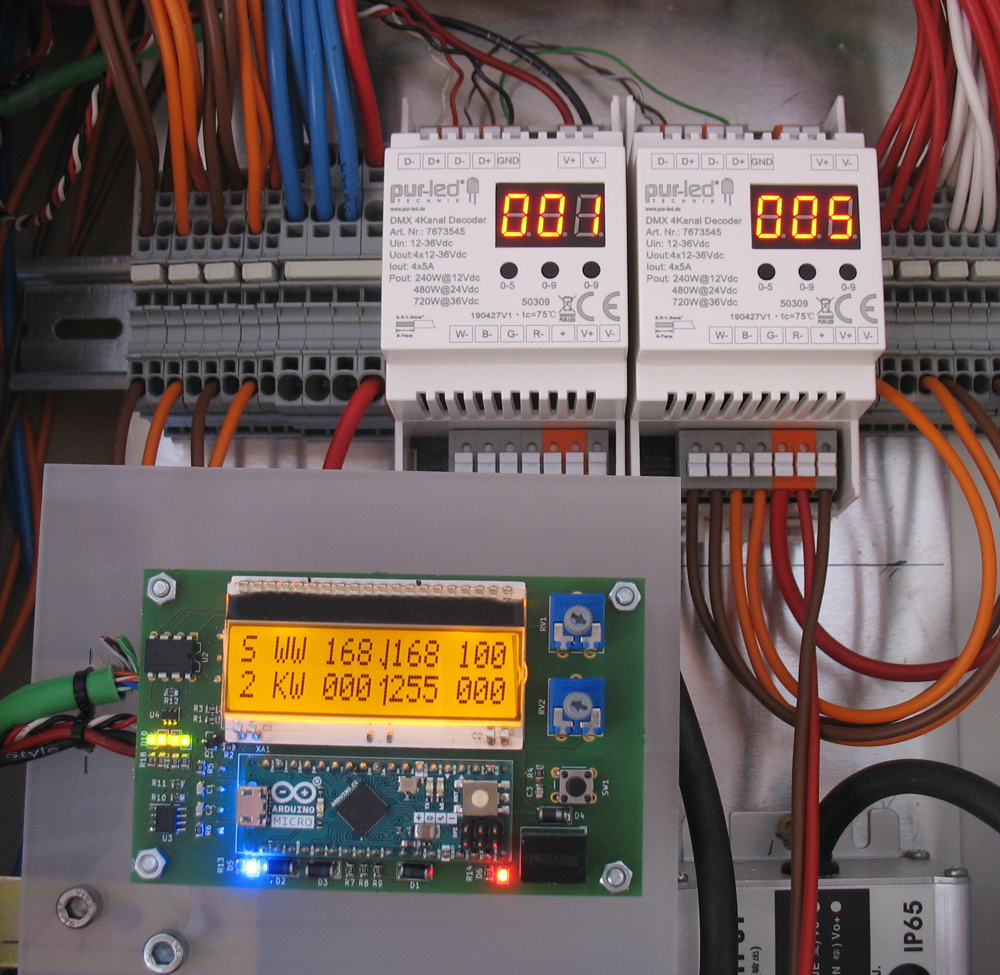

# Home DMC Controll

is a simple arduino based DMX controller to controll led lights installed in your home to be used with DMX controllers and relais.

## Idea

The selection for the lighting scene in daily use should be as simple as possible. Therefore exactly two push buttons are used to move up and down in a list of lighting scenes. Since I am not a fan of idle transformers, a conventional light switch is used in my application to switch the whole system on and off. In the same way a corresponding scene could be set.

The individual scenes should be adjustable directly on the controller without additional hardware. The input of the scenes works like on lighting control desks without motor faders via potentiometer and buttons. To make the firmware easy (without programmer and co) and maintainable by everyone, an Arduino was used, because it has a USB converter and the IDE is easy to use and install.

## End User Usage

### Everyay Usage

Use the two buttons (connecte do SW2 and SW3 on pcb) to change sceene, by going up and down an scene list.

### Configuration

Exact User Interface depends on the project specific arduino programm. The brigness values are set with two analog potis (one for each line). They work like in Ligthning Cosoles. A arrow up/down means the current poti value is below/above the software value. Chhanfing the poti value will not change the software value until bot values where matched once. This is shown when only a pipe is displayed.

#### Page 0

It is used to adjust the brightness of the display and to show the temperature measured by the I2C temperature sensor.

#### Page X (1, ..., 9)

Each page stores one light scene. In my project I have 3 zones of WW/CW LED stripes which should be switched independently. The zones are divided into columns. With SW1 a column can be selected and with RV1 and RV2 the brightness can be adjusted. To switch pages SW2 and SW3 are used which are not on the board. 

## Hard- and Software

Because I want to see if my hardware is running I have a power LED (D4) and a status LED (D5), which is switched on and off in my loop. This may cost an I/O pin, but you can always see if the firmware is running properly.

The MAX481 (U2) is a transceiver for RS-485 and RS-422 communication based on DMX. It uses the TX and RX pins of the arduino. For a visual control of the DMX communication Leds are connected via buffer (U61).

The display is controlled serially via the library provided by the manufacturer.

Since only one interrupt is available when using IC2, all three switches are connected to it via diodes (D1, D2, D3) and the pressed switch is determined in the ISR. The switches are already hardware debaunced.

The board does not has to be fully equipt with the componets.

### Hardware Logic (Isolated)

#### Button Input

A total of 4 buttons can be placed on the pcb. While SW2 and SW3 are hard wired SW1 and SW4 can be set up in 4 different ways to safe pins.

1. **1 buttons 0 extra IO**: SW1 or SW2 are connected only to the Interrupt pin via Diode D1/D4 or a bridge at D1/D4. If an innterupt is triggered, and neither SW2 or SW3 pin is pulled low, SW1 or SW4 must have been pressed.
2. **2 buttons 1 extra IO**: as in one but with JP1/JP2 bridged and SW1/SW4 fully equiped.
3. **2 buttons 2 extra IO**: equip all parts and bridge JP1 and JP2. Interrupt can still be used for other things.
4. **1 buttons 1 extra IO**: as in 3. but with either SW1 or SW4

Swicth 2 and 3 have an additional Isolated input for external switches operating on another voltage level or with different ground.

All Switches and the interupt line are pulled up by R1 to R4 and R9. R4, C1 ect. build low pass filter for hardware debouncing and can be ommited (with the resistors bridged).

#### LCD-Display

The LCD-Display is controlled by 3 Wire SPI connected to the Hardwre SPI of the microcontroller. The MISO master input is not required for the display and is kept free in case additional SPI devices are added (for example via a shield). The Backlight is PWM dimmed via the transisor Q1.

#### Expansion Connector J1 J2

The Connector(s) has the identical pinout as the Arduino Micro. Also you could use a stackable female connector strip for the Arduino.

#### LEDs

In addition to a power LED (D6), there are various Status LEDs on the front side (pcb-back) showing the correct function of the PWM Outputs (D20-23) and the DMX Interface (D60, D61). The LED of the Arduino can be used as a system LED if D13 is not used otherwise.

### Hardware Interfaces (Unisoltated)

All outputs and inputs (connectors) are isolated by default to each other. Resitor Bridges bridges can be apllied (1XX, 2XX) to break those isolations, see chapter Hardware Bridging.

#### X30 - Button Input

Simple current limiting Resistor R30 and R31 for diode of the photocoupler. Needs to be selected for each application by the input voltage V_IN with the formular:

R=(V_IN-V_F)/I_F, V_F=1.2V I_F=20mA

#### X40 - PWM/Output

These autputs can be used in 2 ways. As digital output (with PWM) and as Low Side switch.

A defined pull up voltage can be defined with U140, R142 and R143 (bridging isolation).

#### X50 - Power In

Power input conssits of two parts revers voltage protection and DCDC-Converter. The reverse voltage protection is a siple p channel circuit. For the DCDC-Converter are two footprints obove each other. One for a SIL7 package (with pins 1,2,4,6 connected) and one for a SIL8 package (with pin (1, 2, (3), 6, 7 connected) to allow for different converters to be installed.

#### X60 - DMX

DMX uses the TX/RX pins of the arduino. The MAX481 (U60) is a common RS-485 tranciver. See [www.mathertel.de/Arduino/DMXShield.aspx](http://www.mathertel.de/Arduino/DMXShield.aspx) for a detailed description.

### Hardware Bridging

Danger Zone. Only assemble these components if you know what you are doing as this will bridge isolations.

#### 1XX

Bridges between unisolated interfaces.

- **R130, R131**: VIN to PWM/Ouitput
- **R140, R141**: VIN to Button Input

#### 2XX

Bridges between unisolated interfaces and isolated internal circuit.

- **J250, J251**: Connect these Pads with a wire to use the buildin voltage regulator of the arduino (VIN).
- **R260-R264**: Bypass isolation of DMX interface.

### Software

The scenes and the current page and current column are stored in the EPPROM. Each page/scene has in the current implementation 10 8-bit registers to store DMX values. These can be accessed by adding the number of the register to the start address of the page, where the start address depends on the current page.

The Main Loop consists of 4 parts

1. Check whether a switch has been pressed and do according action
2. Check whether the potentiometer value has changed and whether the value must be adopted and update the display
3. Write DMX values
4. Toogle status LED

Code is more or less self explaining (sorry for the a bit cryptic math logic for pages). Be aware of the pointers in the trace method.

## Project Example (V1.0)

## Licence

See subfolders for indiviadual licences for each part of this project.